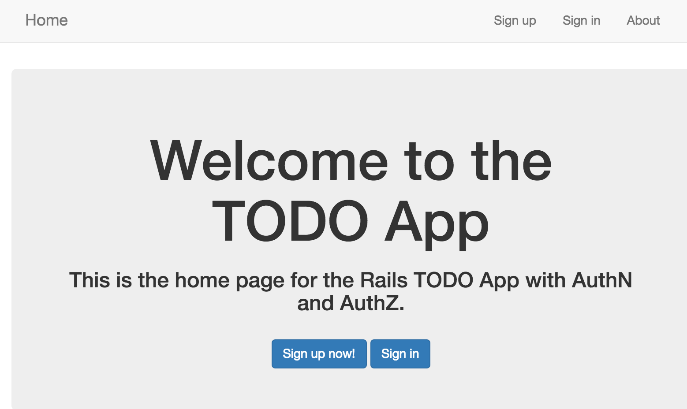

# Adding Security to our TODOs App using _Devise_


{{ TOC }}

## Step 1 - Create a Git Branch

```bash
git checkout -b devise
```

---

## Step 2 - Add the Devise Gem and install Devise

```bash
gem 'devise'
bundle install
rails g devise:install
```

The `rails g` command above will generate the configuration files that we need for Devise.

---

## Step 3 - Add a Default URL for sending EMail from Devise

Edit `config/environments/development.rb` and add the following line:

```ruby
config.action_mailer.default_url_options = { host: 'localhost', port: 3000 }
```

---

## Step 4 - Install the Devise Views

This step is optional but may be desired if you want to customize the Devise views (such as `login` and `signup`).

```bash
rails g devise:views
```

---

## Step 5 - Generate the User Model configured with Devise AuthN.

5a. Generate the _User_ Model using the `devise` generator:

```bash
rails g devise User
```

> Take a look at the generated file: `/app/models/user.rb`.

5b. Run `rails db:migrate`.

---

5c. Configure the root route for Authenticated Users

Our root route is the home page, but we want authenticated users to be sent to their TODOs page! Devise will look for a `user_root_path` and if it is set then will redirect authenticated users to that route.

Edit `config/routes.rb` and add the following line:

```ruby
  get 'user_root', to: 'todos#index', as: :user_root
```

## Step 6 - Secure the TODOs Routes

To ensure that only authenticated users can view the TODOs views, add the following to `app/controllers/todos_controller.rb`:

```ruby
  before_action :authenticate_user!
```

Now you can test it out by starting up your server and trying to navigate to the TODOs page:

```bash
rails s
```

## Step 7 - Add Signup, Login, and Logout Links to the NavBar

7a. Update `app/views/layouts/_navigation_links.html.erb` to match the following:

```html
<% if signed_in? %>
  <li><%= link_to 'TODOs', todos_path %></li>
  <li><%= link_to current_user.email, edit_user_registration_path %></li>
  <li><%= link_to 'Sign out', destroy_user_session_path, method: 'delete' %></li>
<% else %>
  <li><%= link_to 'Sign up', new_user_registration_path %></li>
  <li><%= link_to 'Sign in', new_user_session_path %></li>
<% end %>
<li><%= link_to 'About', '/about' %></li>
```

7b. Edit `app/views/static_pages/home.html.erb` and add the following buttons to the bottom of the jumbotron:

```html
  <br/>
  <%= link_to "Sign up now!", new_user_registration_path, class: "btn btn-large btn-primary" %>
  <%= link_to "Sign in",      new_user_session_path,      class: "btn btn-large btn-primary" %>
```

7c. Verify that the NavBar looks good:



## Step 8 - Add Authorization

We have some basic Authorization working (only authenticated users can navigate to the Todo routes) but we still have some Authorization bugs to work out. Specifically we need to:

* Associate TODOs with a specific user.
* Ensure that users can only read, update, and delete their own TODOs.

8a. Create a migration to associate Todos with Users

```bash
rails g migration AddUserRefToTodos user:references
```

8b. Edit the `add_user_ref_to_todos` migration script and add a not-null constraint: `null: false`

8c. Remove any old TODOs from the DB and then run the migrations:

```bash
rails c
[1] pry(main)> Todo.destroy_all
[2] pry(main)> quit
rails db:migrate
```

and inspect the file `db/schema.rb` to ensure that the model / table looks correct.


8d. Edit `app/models/todo.rb` and add the following:

```ruby
  belongs_to :user
```

8e. Edit `app/models/user.rb` and add the following:

```ruby
  has_many :todos, dependent: :destroy
```

8f. Edit `app/controllers/todos_controller.rb`:

* update the `set_todo` method to check that the requested todo belongs to the `current_user`:

```ruby
# Use callbacks to share common setup or constraints between actions.
  def set_todo
    @todo = Todo.find(params[:id])
    redirect_to root_url, notice: 'Access Denied!' unless current_user.id == @todo.user.id
  end
```

* edit the `index` method to only return the `current_user`'s todos:

```ruby
  def index
    @todos = current_user.todos.order(created_at: :desc)
  end
```

 * edit the `create` method to associate a newly created Todo to the `current_user`:

```ruby
  def create
    @todo = Todo.new(todo_params)
    @todo.user = current_user       # associate the new todo to the current_user
    ...
```

## Step 9 - Check for security holes and fix them

* See what routes a user can manually enter into the browser even if the user is not logged in
* Can a user edit the account of another user? Can a user change another user's password?
* See if a user can manually enter the URL for a TODO that is not one of their TODOs. Can the user edit or delete TODOs that they do not own?

## Step 10 - Merge Feature Branch Into Master

```bash
git checkout master
git merge devise
```

## References

* [Devise](https://github.com/plataformatec/devise)
* [Devise Documentation](http://devise.plataformatec.com.br/)
